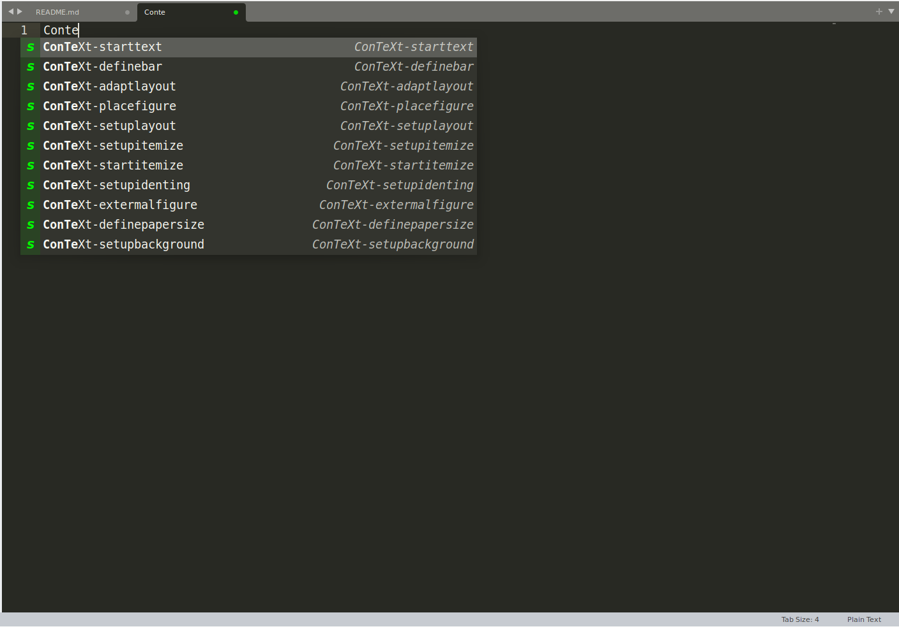

About
-----
This is a (*simple*) collection of snippets to use with [sublime text](http://www.sublimetext.com/).

How to use?
-----------

First, install the `snippet`

### Installing Snippets

Execute `make`.


Type the beginning of the `snippet`, eg: "ConTeXt-" or "start" and press tab, choose the `snippet`, press <enter>.



Another option is to press CTLR-P and start to type `snippet` or the name of a `snippet`, eg: "mussum".

Available `snippets`
--------------------


```
ConTeXt-definebar.sublime-snippet
ConTeXt-definefontfamily.sublime-snippet
ConTeXt-setuplayout.sublime-snippet
ConTeXt-setupbackground.sublime-snippet
ConTeXt-setupindenting.sublime-snippet
ConTeXt-adaptlayout.sublime-snippet
ConTeXt-definepapersizer.sublime-snippet
ConTeXt-externalfigure-framed.sublime-snippet
ConTeXt-externalfigure.sublime-snippet
ConTeXt-placefigure-complete.sublime-snippet
ConTeXt-placefigure.sublime-snippet
ConTeXt-setupitemize.sublime-snippet
ConTeXt-startitemize.sublime-snippet
ConTeXt-starttext.sublime-snippet
ConTeXt-tikz-overlay.sublime-snippet
mussumipsum-formula.sublime-snippet     # lipsum
mussumipsum.sublime-snippet				# lipsum
```
